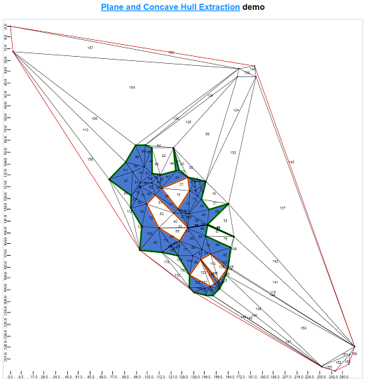

# Polylidar Demonstration on Web

## Overview

This was the original implementation of Polylidar, written in Typescript. This repository had a lot of trial and error and was meant to test different ideas. A new version written in C++ and as a python extension is found [here](https://github.com/JeremyBYU/polylidarv2). This (Typescript) version is **not** maintained and is missing some important features that the C++ version provides (it may also have bugs).  Additionally the parameters (function arguments) to Polylidar in this version are different. This repository is meant as a quick demo.

There are two demos provided. 

### 2D 

A 2D demo with fixed parameters. This is just meant to show the speed of polylidar. Planes/Regions are extracted with separate colors.  The concave hull is shown in green with interior holes in orange. This demo is inspired (even pulled code from) the [delaunator](https://github.com/mapbox/delaunator) library. [Link to live demo](https://jeremybyu.github.io/polylidarweb/demo2d/index.html)

### 3D

This shows the 3D component of Polylidar. Simulated point clouds from a LiDAR sensor are provide of building rooftops. Parameters can be changed dynamically with a widget on the left. You can toggle different point clouds with a dropdown. [Link to live demo](https://jeremybyu.github.io/polylidarweb/demo3d/index.html)

## Misc

1. Delaunay Triangulation using `delaunator` - 1 ms
2. Plane Extraction - 1.3 ms
3. Concave Hull Extraction - 1.5 ms

## Install

0. cd `dir`
1. `npm install`
2. `npm test`
3. `npm run demo-2d`
3. `npm run demo-3d`

## Algorithm

Please see the algorithm description in the paper.